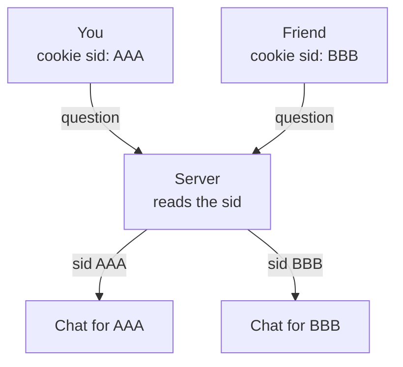

# How two people stay separate

Each browser gets its own id (a cookie called `sid`).
The server keeps a separate chat for each `sid`, so answers never mix.

**Key point:** each browser has its own `sid`, so answers never mix between users.

See also the picture version: [multi-user-isolation.svg](multi-user-isolation.svg)
